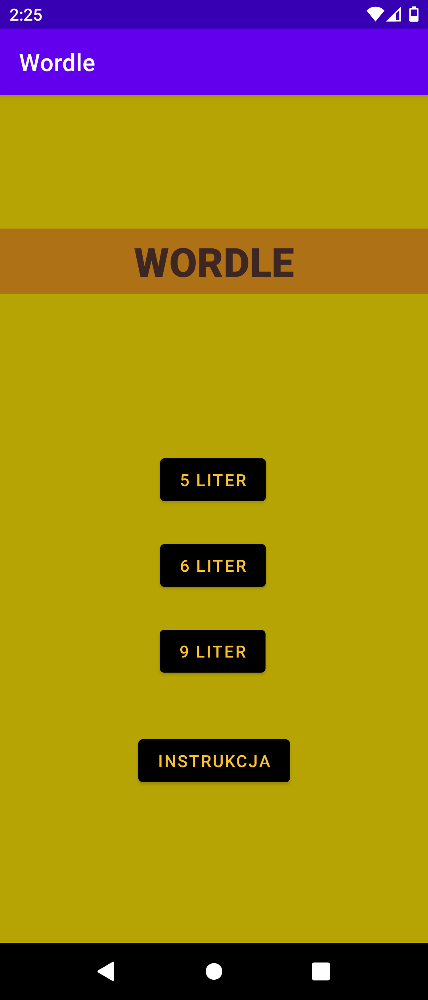
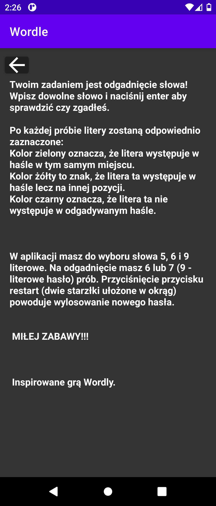
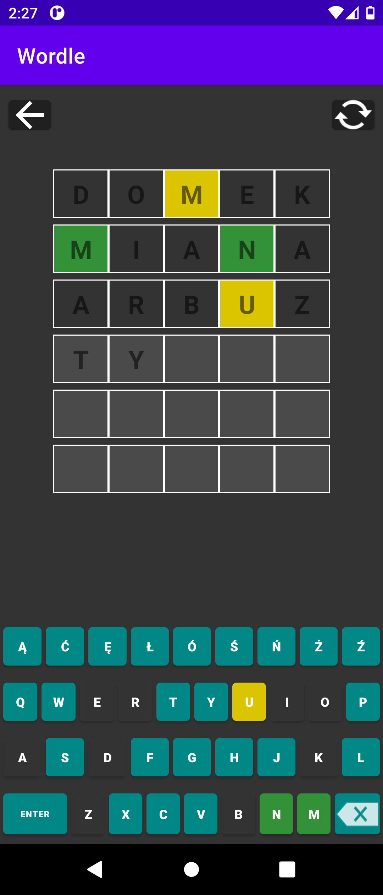

# Wordle - polish version

English text below.   

## Inspiracja

Aplikacja powstała na bazie znanej aplikacji webowej [Wordle](https://www.nytimes.com/games/wordle/index.html). Dlaczego ją napisałem? Po pierwsze chciałem nauczyć się pisać aplikacje na system android w Javie. Po drugie nie chciałem czekać całej doby na nowe hasło. Aplikacja powstała w jezyku Polskim.

## Jak uruchomić

Aby skorzystać z aplikacji należy pobrać jej skompresowaną wersję [app/release/app-release.apk](https://github.com/gregori0o/wordle_app/blob/master/app/release/app-release.apk) i zainstalować na swoim smartfonie.

## Aplikacja

Aplikacja pozwala na granie w jednym z trzech trybów. Odgadujemy hasło 5, 6 lub 9 literowe.

Mamy również krótką instrukcję informującą o zasadach gry.

Gra polega na wpisywaniu kolejnych haseł, próbując odgadnąć właściwe. Po każdym wpisie dostajemy informację zwrotną w postaci odpowiedniego kolorowania pól. Aby zmienić odgadywane hasło wystarczy wcisnąć przycisk restart w prawym górnym rogu. Przykładowa rozgrywka wygląda następująco:

## Słownik

Do zbudowania aplikacji skorzystałem ze słownika udostępnionego na stronie [sjp.pl](https://sjp.pl/slownik/odmiany/).

## Licencja

[MIT License](LICENSE.md)

 

## Inspiration

App is based on the well-known web application [Wordle](https://www.nytimes.com/games/wordle/index.html). Why did I write it? Firstly, I wanted to learn writing android app in Java. Secondly, I didn't want to wait all day for a new word. App was created in polish language.

## How to use

You have to download compressed version [app/release/app-release.apk](https://github.com/gregori0o/wordle_app/blob/master/app/release/app-release.apk) and install it on your mobile phone.

## App

App allows to play in one of three modes. You can guess 5, 6, or 9 letter word.

In app there is short instruction of game rules.

In the game you have to guess word and click enter to validate it. After each guess the color of the tiles will change to show how close your guess was to word. To change the word to guess click restart button in the upper right corner. Example of the game below:

## Library

To build app I use library from [sjp.pl](https://sjp.pl/slownik/odmiany/).

## License

[MIT License](LICENSE.md)
